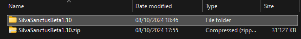

# Silva Sanctus

## What is Silva Sanctus

Silva Sanctus is a replayable roguelite dungeon-crawler game set in a forest, made in a pixel art style.

## How to download

The download can be found on either on the [dedicated itch.io page](https://padjokej.itch.io/silva-sanctus), or in the [releases tab](https://github.com/PadjokeJ/SilvaSanctus/releases/tag/Beta1.10)
Once you have downloaded the version, please refer to the [How to run](#how-to-run) section.

## How to run
### On windows
Extract the zip file you have downloaded.

Once you have extracted, you should have a folder named like so

Inside this folder, there is another folder named after the game version

Inside this folder, find SilvaSanctus.exe or SilvaSanctus, and open it by double-clicking it

Provided this is the first time you run this game, you might have a popup warning you that this app may be malicious
Click on More Info, and then Run anyway 

The game should then launch

### On Mac
I have sadly not had any luck running this game on a MacOS powered machine. 
